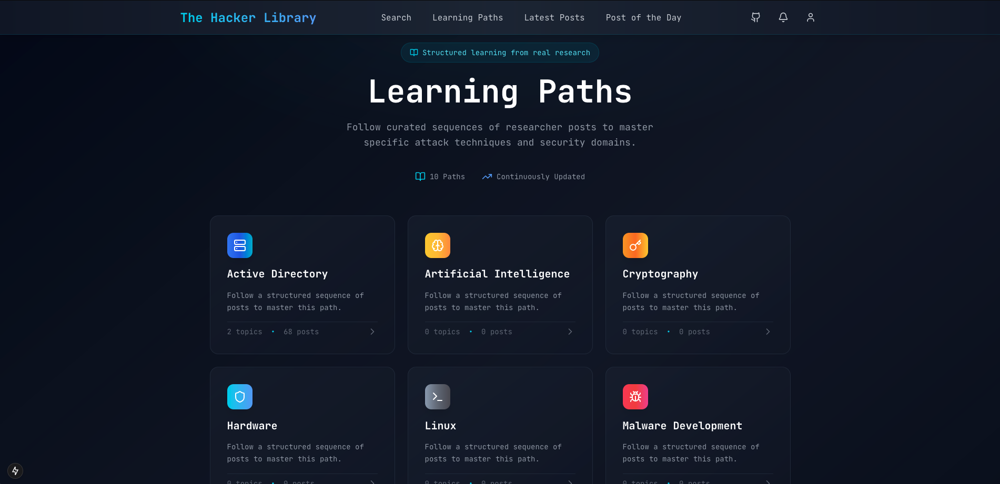

<p align="center">
  
</p>

TheHackerLibrary is a free, not sponsored library of hacking learning resources. The goal is to reference security posts so that it is easy for anyone to just dig *dive* into a topic without buying courses.



## Self-hosting

This project is live [here](https://thehackerlibrary.nioz.fr), however you can easily self-host it too using docker.

The first step is to clone the git repository:

```sh
git clone https://github.com/niozow/thehackerlibrary.git
cd thehackerlibrary
```

Then copy the `.env.example` and change environment variable :

```sh
cp .env.example .env
cat .env
POSTGRES_USER="thehackerlibrary"
POSTGRES_PASSWORD="thehackerlibrary"
POSTGRES_DB="thehackerlibrary"
AUTH_URL="http://localhost:3000"
AUTH_SECRET=""
AUTH_GITHUB_ID=""
AUTH_GITHUB_SECRET=""
```

- `AUTH_SECRET` : Generate it using `openssl rand -base64 32`
- `AUTH_GITHUB_ID` and `AUTH_GITHUB_SECRET` can be set by creating a new github OAuth app from the [settings](https://github.com/settings/developers).
- `AUTH_URL` must be the URL of the website.
- `POSTGRES_*` should be information related to the postgres database.

Then you can launch the app using docker :

```sh
docker compose up -d
```

The database will be empty and uninitialised, you can use the following from [thehackerlibrary.py](https://github.com/niozow/thehackerlibrary.py) to upload data and initialise it:

```sh
thehackerlibrary import ./data/
```

## Contributing

All referenced posts are stored in the `./data` directory in forms of **YAML** files. You can edit those **YAML** files to contribute to the project. However, as editing the **YAML** directly is tedious because of references, I suggest you edit those using [thehackerlibrary.py](https://github.com/niozow/thehackerlibrary.py). You can then make a [Pull Request](https://github.com/NioZow/thehackerlibrary/pulls) to contribute.
